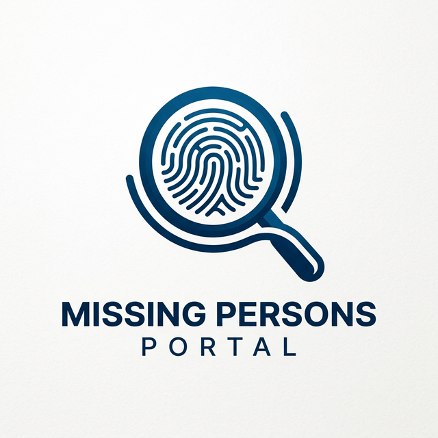

<p align="center">
  
</p>

# 🔍 Missing Persons Portal

[](https://www.djangoproject.com/)
[](https://www.python.org/)
[](https://github.com/serengil/deepface)

A sophisticated Django-based web application designed to help find missing persons using AI-powered facial recognition and sentiment analysis. This platform bridges the gap between the public and law enforcement, providing real-time tracking and advanced analysis tools.

---

## 🌟 Key Features

### 👤 User Portal
*   **Case Registration**: Easily register a missing person case with high-resolution photos and detailed descriptions.
*   **Real-time Tracking**: Stay updated with a live status tracker for investigation progress.
*   **Interactive Feedback**: Share feedback that is automatically analyzed for sentiment to help improve service quality.

### 👮 Admin & Police Portal
*   **Intelligent Dashboard**: At-a-glance view of active cases, recovery statistics, and historical trends.
*   **AI Face Matching**: Leverages `DeepFace` and `OpenCV` to automatically match submitted photos against a library of found persons.
*   **Sentiment Visualization**: Dynamic heatmaps and graphs showcasing public sentiment and response trends.

---

## 🛠️ Technical Stack

| Component      | Technology                                                                 |
| :------------- | :------------------------------------------------------------------------- |
| **Backend**    | Django (Python), SQLite/MySQL                                              |
| **AI / ML**    | DeepFace, TensorFlow, OpenCV, NLTK, TextBlob                               |
| **Frontend**   | Semantic HTML5, Responsive CSS3, Modern JavaScript                         |
| **Packages**   | `numpy`, `pillow`, `requests`                                              |

---

## 🚀 Getting Started

### Prerequisites
*   Python 3.x
*   Virtual Environment tool (`venv`)

### Setup Instructions

1.  **Clone the repository**:
    ```bash
    git clone https://github.com/JaaniBee/search-missing-persons.git
    cd search-missing-persons
    ```

2.  **Initialize Environment**:
    ```bash
    python -m venv venv
    source venv/bin/activate  # On Windows: venv\Scripts\activate
    ```

3.  **Install Dependencies**:
    ```bash
    pip install -r requirements.txt
    ```

4.  **Run Migrations**:
    ```bash
    python manage.py migrate
    ```

5.  **Launch Server**:
    ```bash
    python manage.py runserver
    ```
    Access the portal at `http://127.0.0.1:8000/`.

---

## 🤝 Contributing

Contributions are what make the open source community such an amazing place to learn, inspire, and create. Any contributions you make are **greatly appreciated**.

